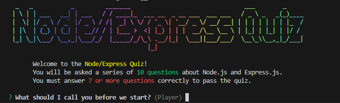

# Node/Express Quiz



This repository contains the code for a simple Node/Express quiz application. This is a simple command-line application that asks the user a series of 10 questions and then displays the results. At least a 7 out of 10 is a passing score. The application is built using Node.js, Chalk, Chalk Animation, Figlet, Gradient String, Inquirer, and Nanospinner.

To run the application, clone the repository and type in the terminal:

```bash
node .
```